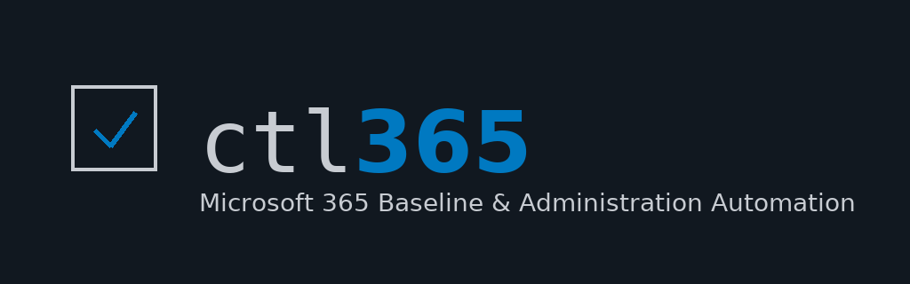

<p align="center">
  
</p>

<p align="center">
  
</p>

<p align="center">
  <strong>Enterprise-grade Microsoft 365 deployment automation for MSPs and IT professionals</strong>
</p>

<p align="center">
  
  
  
  
</p>

---

## 📦 Install on Windows

```powershell
irm https://raw.githubusercontent.com/ResoTech/ctl365/main/release/windows/bootstrap.ps1 | iex
```

See [INSTALL.md](INSTALL.md) for Windows and Linux installation options.

---

## 🚀 Quick Start

```bash
# Authenticate to Microsoft 365
ctl365 tenant add my-tenant \
  --tenant-id "YOUR-TENANT-ID" \
  --client-id "YOUR-APP-CLIENT-ID" \
  --client-secret "YOUR-SECRET" \
  --client-credentials

ctl365 login

# Generate and deploy Windows baseline
ctl365 baseline new windows --template oib --encryption --defender -o baseline.json
ctl365 baseline apply --file baseline.json

# Deploy Conditional Access policies
ctl365 ca deploy --baseline 2025 --report-only

# Import Autopilot devices
ctl365 autopilot import --file devices.csv --group-tag production
```

**📚 Documentation:** [Getting Started](GETTING_STARTED.md) | [Testing Guide](TESTING_GUIDE.md) | [App Registration](docs/APP_REGISTRATION.md)

---

## ✨ Features

### 🖥️ **Platform Support**

| Platform | Compliance | Configuration | App Protection | Defender | Templates |
|----------|-----------|---------------|----------------|----------|-----------|
| **Windows 11 25H2** | ✅ | ✅ Settings Catalog | ✅ | ✅ MDE | basic, oib |
| **macOS** | ✅ | ✅ Device Features | ✅ | ✅ MDE | basic, oib |
| **iOS/iPadOS** | ✅ | ✅ Restrictions | ✅ MAM | ✅ MDE | basic, oib |
| **Android** | ✅ Work Profile + Fully Managed | ✅ MAM | ✅ MDE | basic, oib |

### 🔐 **Baseline Templates**

- **OpenIntuneBaseline v3.6** (OIB) - Production-ready baseline for Windows 11 25H2
  - 6 core policies (4 Compliance + 2 Settings Catalog) - **Tested & Verified ✓**
  - CIS-aligned with documented deviations
  - Frameworks: NCSC, CIS, ACSC Essential Eight, MS Baselines
  - Features: BitLocker XTS-AES-256, Defender for Endpoint, TPM-only startup
  - Additional policies (WHfB, LAPS, ASR, Firewall) - In development

- **Basic** - Simple, straightforward baseline for quick deployments

- **Coming Soon**: Microsoft Security Baseline (official), CIS Benchmark

### 🎯 **Conditional Access**

**44 Production-Ready Policies** (CABaseline2025)
- Based on Kenneth van Surksum and Daniel Chronlund best practices
- Device/Platform policies (CAD001-016): Compliant devices, legacy OS blocking
- Location-based policies (CAL002, CAL004, CAL011): Geographic restrictions, trusted locations
- Protocol policies (CAP001-004): Block legacy auth, modern auth enforcement
- Risk-based policies (CAR001-005): Sign-in risk, user risk, MFA requirements
- Service-specific policies (CAS001-008): Azure portal, O365, Exchange, SharePoint
- User-based policies (CAU001-011): MFA, guest access, admin protection

All policies start in "Report-only" mode for safe deployment.

### 📱 **Application Deployment**

- **Win32 Apps** - Deploy packaged .intunewin applications
- **Microsoft 365 Apps** - Office suite with XML configuration
- **Microsoft Store** - Windows Store app deployment
- **iOS VPP Apps** - Volume Purchase Program apps
- **Android Managed Play** - Google Play Store apps
- **Web Apps** - Web application links

### ✈️ **Windows Autopilot**

- **Device Import** - Bulk import via CSV with hardware hashes
- **Deployment Profiles** - User-driven, Self-deploying, White Glove modes
- **Profile Assignment** - Assign to devices, groups, or group tags
- **Device Management** - List, status, sync, delete operations
- **Hybrid Azure AD Join** - Support for hybrid environments

### 🔄 **Export/Import with Assignment Migration**

- **Settings Catalog Support** - Export modern configuration policies
- **Assignment Migration** - Tenant-to-tenant with group mapping
- **Multiple Strategies** - Manual mapping, exact match, auto-create groups
- **Incremental Sync** - Skip existing policies
- **Conflict Resolution** - Update, skip, or fail on conflicts

### 🔍 **Audit & Compliance**

- **Drift Detection** - Compare baseline vs actual configuration
- **Auto-Remediation** - Automatically create missing policies (`--fix` flag)
- **Compliance Scoring** - 0-100 score based on controls passed
- **Report Generation** - HTML, CSV, JSON formats
- **Baseline Comparison** - Compare against OIB, CIS, ScubaGear, custom baselines

### 🏢 **Multi-Tenant MSP Features**

- **Interactive TUI** - Menu-driven client management
- **Client Abbreviations** - Use short codes (RLAW, IRON, ITWO)
- **App Registration Wizard** - Step-by-step Azure AD setup
- **Change Control Reports** - HTML reports for client billing
- **Per-Tenant Authentication** - Device Code Flow or Client Credentials
- **Standardized Deployments** - Same baseline across all clients
- **Bulk Operations** - Export from one, import to many

```bash
# MSP Client Management
ctl365 tui clients         # Interactive client management
ctl365 tui configure       # Configure active tenant interactively
ctl365 tui defender        # Defender for Office 365 settings
ctl365 tui exchange        # Exchange Online settings
```

### 🌐 **SharePoint & Viva**

- **SharePoint Sites** - Create communication and team sites
- **Hub Sites** - Configure and join hub sites
- **Page Management** - Create, list, delete SharePoint pages
- **Viva Engage** - Community and member management
- **Viva Connections** - Configure home site

### 🤖 **Copilot & AI Agents**

- **Agent Discovery** - List Microsoft and custom agents
- **Content Search** - Search across M365 content
- **Compliance Export** - Export Copilot interactions for compliance
- **Meeting Insights** - Access Copilot meeting summaries

### 🛡️ **CISA SCuBA Baseline**

- **Security Audits** - Run SCuBA compliance assessments
- **Product Coverage** - AAD, Defender, Exchange, SharePoint, Teams
- **Status Tracking** - Monitor baseline compliance

### 🔒 **Safety Features**

All mutation commands support:
- `--dry-run` - Preview changes without applying
- `-y/--yes` - Skip confirmation prompts for automation

### 📊 **Logging & Observability**

- `-v` / `-vv` / `-vvv` - Verbosity levels (info/debug/trace)
- `--log-file <FILE>` - Write logs to file for debugging
- `-q` / `--quiet` - Suppress output except errors
- Progress bars for long-running operations

---

## 🛠️ Command Reference

### Authentication
```bash
ctl365 tenant add <name> --tenant-id <id> --client-id <id> [--client-secret <secret>]
ctl365 tenant list [--verbose]
ctl365 tenant switch <name>
ctl365 login [--tenant <name>]
ctl365 logout [--all]
```

### Baselines
```bash
ctl365 baseline list
ctl365 baseline new <platform> --template <template> [--encryption] [--defender] [-o file.json]
ctl365 baseline apply --file <file.json> [--group-id <id>] [--dry-run]
```

**Platforms:** `windows`, `macos`, `ios`, `android`
**Templates:** `basic`, `oib` (openintune)

### Conditional Access
```bash
ctl365 ca deploy --all [--dry-run] [-y]
ctl365 ca deploy --mfa | --geoip-block | --compliant-device | --block-legacy-auth | --admin-mfa
ctl365 ca list
```

### Application Deployment
```bash
ctl365 app deploy --name <name> --type <type> --file <path> [--group-id <id>]
ctl365 app deploy-m365 --suite <suite> --architecture <arch> --apps <list>
ctl365 app list [--platform <platform>]
ctl365 app remove <app-id> [--assignments-only]
```

### Autopilot
```bash
ctl365 autopilot import --file <devices.csv> [--group-tag <tag>] [--dry-run] [-y]
ctl365 autopilot profile --name <name> --mode <mode> [--dry-run]
ctl365 autopilot assign --profile-id <id> [--device <serial>] [--dry-run]
ctl365 autopilot list [--group-tag <tag>]
ctl365 autopilot sync | status <device-id> | delete <device-id>
```

**Modes:** `user-driven`, `self-deploying`, `white-glove`

### SharePoint
```bash
ctl365 sharepoint site-create --name <name> --url-name <url> [--site-type team|communication]
ctl365 sharepoint site-list | site-get --id <id>
ctl365 sharepoint hub-list | hub-set --site-id <id> | hub-join --site-id <id> --hub-id <id>
```

### Viva Engage
```bash
ctl365 viva community-create --name <name> --privacy public|private
ctl365 viva community-list | community-delete --id <id>
ctl365 viva role-assign --user-id <id> --role network-admin|corporate-communicator
```

### Copilot
```bash
ctl365 copilot agents-list | agents-get --id <id>
ctl365 copilot search --query <query>
ctl365 copilot interactions-export [--start <date>] [--end <date>]
```

### SCuBA
```bash
ctl365 scuba audit [--products aad,defender,exo]
ctl365 scuba status | baselines
```

### Export/Import
```bash
ctl365 export export --types <types> [--include-assignments] [-o <dir>]
ctl365 export import --directory <dir> [--group-mapping <file>] [--create-groups]
```

**Types:** `compliance`, `configuration`, `settings-catalog`, `apps`, `all`

### Audit
```bash
ctl365 audit check [--output <format>] [--output-file <file>]
ctl365 audit drift --baseline <file> [--detailed] [--fix] [--dry-run]
```

---

## 🏗️ Architecture

### Technology Stack

| Component | Technology |
|-----------|-----------|
| **Language** | Rust 2024 Edition |
| **HTTP Client** | reqwest with rustls-tls |
| **Authentication** | OAuth2 (Device Code + Client Credentials) |
| **API** | Microsoft Graph v1.0 + beta |
| **CLI** | clap 4.5 |
| **Async Runtime** | tokio |
| **Serialization** | serde, serde_json, toml |

### Security

- **Token Storage**: Cached in `~/.config/ctl365/cache/` with 600 permissions
- **OAuth2 Standard Flows**: No password storage
- **Client Secrets**: Optional, only for automation workflows
- **Bearer Tokens**: In-memory only during API calls
- **Retry Logic**: Automatic retry with exponential backoff for transient failures
- **Rate Limiting**: Respects Retry-After headers from Graph API

### Configuration

```
~/.config/ctl365/            # Linux/macOS
%LOCALAPPDATA%\ctl365\       # Windows

├── config.toml              # Global configuration
├── tenants.toml             # Tenant registry
└── cache/
    └── <tenant>.token       # Cached access tokens
```

---

## 📋 Requirements

### App Registration Permissions

Your Azure AD app registration needs the following Microsoft Graph API permissions:

**Delegated Permissions:**
```
DeviceManagementConfiguration.ReadWrite.All
DeviceManagementApps.ReadWrite.All
DeviceManagementManagedDevices.ReadWrite.All
DeviceManagementServiceConfig.ReadWrite.All
Directory.ReadWrite.All
Group.ReadWrite.All
Policy.ReadWrite.ConditionalAccess
```

**Application Permissions** (for client credentials flow):
```
Same as above, plus:
Exchange.ManageAsApp  (optional, for Exchange Online config)
```

**✅ Admin consent must be granted** for all permissions.

📖 **Setup Guide**: [docs/APP_REGISTRATION.md](docs/APP_REGISTRATION.md)

---

## 🎯 Use Cases

### MSP Onboarding
```bash
# Standardized baseline for new client
ctl365 baseline new windows --template oib --encryption --defender -o client-baseline.json
ctl365 baseline apply --file client-baseline.json --group-id <all-users-group>

# Deploy CA policies in report-only mode
ctl365 ca deploy --baseline 2025 --report-only

# Import Autopilot devices
ctl365 autopilot import --file client-devices.csv --group-tag client-name
```

### Compliance Auditing
```bash
# Generate compliance report
ctl365 audit check --output html --output-file compliance.html

# Detect drift from baseline
ctl365 audit drift --baseline production-baseline.json --detailed

# Auto-fix drift
ctl365 audit drift --baseline production-baseline.json --fix
```

### Tenant Migration
```bash
# Export from source
ctl365 tenant switch source-tenant
ctl365 export export --types all --include-assignments -o export/

# Import to destination
ctl365 tenant switch dest-tenant
ctl365 export import --directory export/ --create-groups --group-mapping mapping.json
```

---

## 📊 Feature Comparison

### ctl365 vs Manual Intune Configuration

| Task | Manual (Intune Portal) | ctl365 |
|------|----------------------|--------|
| **Deploy Windows baseline** | 2-4 hours (click through 15+ policies) | `ctl365 baseline apply` (< 5 min) |
| **Conditional Access (44 policies)** | 4-6 hours | `ctl365 ca deploy` (< 2 min) |
| **Multi-tenant standardization** | Copy/paste, manual group mapping | Automated with assignment migration |
| **Drift detection** | Manual comparison | `ctl365 audit drift` with auto-fix |
| **Version control** | Screenshot documentation | JSON baselines in Git |
| **Autopilot import** | CSV upload, manual profile assignment | CLI automation with group tags |

---

## 🗺️ Roadmap

See [ROADMAP.md](ROADMAP.md) for detailed planning.

**v1.0 Goals:**
- ✅ All platforms (Windows, macOS, iOS, Android)
- ✅ Conditional Access (44 CABaseline2025 policies)
- ✅ Autopilot integration
- ✅ Application deployment
- ✅ Export/import with assignments
- ✅ Audit and drift detection
- ✅ SharePoint & Viva management
- ✅ Copilot & AI agent discovery
- ✅ CISA SCuBA baseline audits
- ✅ Safety flags (--dry-run, -y/--yes)
- ✅ Logging & observability (-v/-vv/-vvv, --log-file)
- ✅ Test infrastructure (155+ tests)
- ⏳ End-to-end testing with production tenant
- ⏳ Cross-platform binaries (Windows, macOS, Linux)

**Future:**
- Certificate-based authentication
- GitOps integration (auto-deploy on commit)
- Web dashboard (Tauri + React)
- Terraform provider
- Slack/Teams notifications

---

## 🤝 Contributing

We welcome contributions! See [CONTRIBUTING.md](CONTRIBUTING.md) for guidelines.

**Areas needing help:**
- Testing with diverse tenant configurations
- Additional baseline templates (NIST, PCI-DSS, HIPAA)
- Documentation improvements
- Bug reports and feature requests

---

## 📝 License

Copyright 2025 Resolve Technology LLC. See [LICENSE](LICENSE) for details.

---

## 🙏 Credits

- **OpenIntuneBaseline** - Daniel Chronlund (Microsoft MVP)
- **CABaseline2025** - Kenneth van Surksum, Daniel Chronlund
- **Microsoft Graph API** - Microsoft Corporation

---

## 📞 Support

- **Documentation**: [docs/](docs/)
- **Issues**: [GitHub Issues](https://github.com/yourusername/ctl365/issues)
- **Discussions**: [GitHub Discussions](https://github.com/yourusername/ctl365/discussions)

---

**🛡️ Built for MSPs managing Microsoft 365 at scale**

*Control, configure, and secure Microsoft 365 — at scale.*
